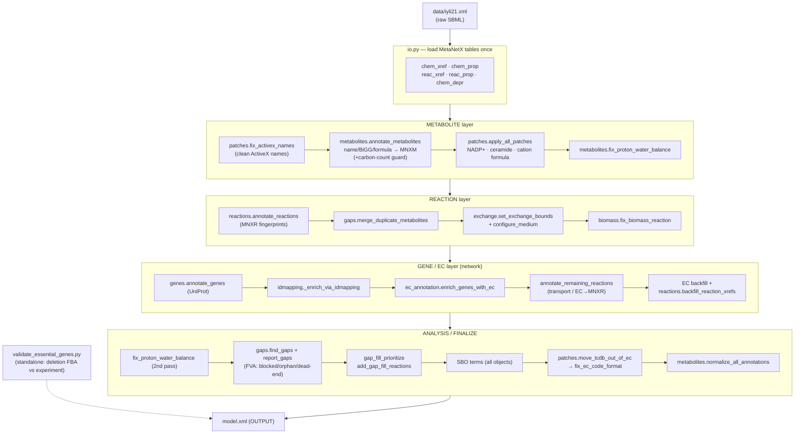

# `gem_annotate` Pipeline Workflow

This document describes the annotation pipeline in `scripts/gem_annotate/`,
orchestrated by `main.py`. It reads the raw SBML model, enriches it through
metabolite → reaction → gene/EC layers, runs gap analysis, and writes the final
`model.xml`. Stage labels in brackets (e.g. `[1+2a]`, `[4a]`) match the inline
comments in `main.py`.

## Overview



## Stages

### Inputs
- **`data/iyli21.xml`** — raw SBML model (genes already in YALI1 naming).
- **`io.py`** — loads the MetaNetX reference tables (`chem_xref`, `chem_prop`,
  `reac_xref`, `reac_prop`, `chem_depr`) once and reuses them across all steps.

### Metabolite layer
- **pre — `patches.fix_activex_names`** — strips the Excel-export corruption
  suffix `_ActiveX VT_ERROR:` from metabolite names so the next step can match
  them. Must run *before* annotation.
- **`[1+2a]` `metabolites.annotate_metabolites`** — maps each metabolite to a
  MetaNetX ID and pulls formula/charge/cross-refs. Match strategies, in
  priority order: `A` (BiGG), `BD` (direct MNXM table), `B`/`B0`/`B1`/`B2a`/`B2b`
  (exact / Excel-fix / synonym / normalized / prefix name match), `C` (formula).
  A **carbon-count guard** rejects any name-match whose carbon count disagrees
  with the metabolite's known formula (prevents name collisions).
- **`patches.apply_all_patches`** — fixes known data bugs: NADP+ formula,
  ceramide formulas, and protonated-cation formula/charge consistency.
- **`[2b]` `metabolites.fix_proton_water_balance`** — balances H⁺/H₂O.

### Reaction layer
- **`[4a]` `reactions.annotate_reactions`** — assigns MNXR IDs via metabolite
  fingerprints.
- **`gaps.merge_duplicate_metabolites`** — merges known duplicate metabolite
  pairs for stoichiometric consistency.
- **`[2c]` `exchange.set_exchange_bounds` + `configure_medium`** — exchange
  bounds and minimal-medium / vitamin configuration.
- **`[3]` `biomass.fix_biomass_reaction`** — biomass reaction R1372.

### Gene / EC layer (requires network)
- **`[4b]` `genes.annotate_genes`** — UniProt proteome → gene cross-refs.
- **`[4c]` `idmapping._enrich_via_idmapping`** — ncbigene → UniProtKB.
- **`[4d]` `ec_annotation.enrich_genes_with_ec`** — gene EC numbers.
- **`[4e]` `annotate_remaining_reactions`** — exchange / transport fingerprint /
  EC→MNXR for reactions still unannotated.
- **EC backfill** — copies gene `ec-code` to reactions, then
  `reactions.backfill_reaction_xrefs` fills bigg/kegg/rhea/ec from MNXR.

### Analysis / finalize
- **`[2b']`** second H⁺/H₂O balance pass (more formulas now available).
- **`[5]` `gaps.find_gaps` + `report_gaps`** — FVA → blocked / orphan / dead-end.
- **`[6]` gap-fill** — inserts prioritized P0 reactions.
- **SBO terms** — assigns SBO terms to all model objects (cf. `add_sbo_terms.py`).
- **EC format** — `patches.move_tcdb_out_of_ec` (TCDB numbers → `tcdb` field)
  then `patches.fix_ec_code_format` (pad partial EC codes). Runs last, after all
  EC codes are populated.
- **`metabolites.normalize_all_annotations`** — final annotation cleanup.
- **Output:** `write_sbml_model` → `model.xml`.

## Standalone helpers (not in the main pipeline)
- **`validate_essential_genes.py`** — single-gene-deletion FBA compared against
  experimental essentiality data.
- **`http_utils.py`** — retry wrapper used by the network steps
  (`genes`, `ec_annotation`, `idmapping`).

## Running
```bash
bash run.sh          # runs the pipeline, then a Memote snapshot into results/
# or just the pipeline:
python -m scripts.gem_annotate
```
